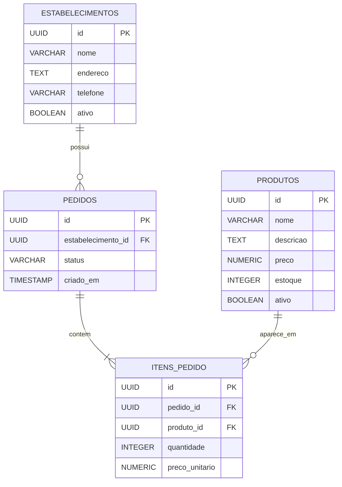

```mermaid
erDiagram
    ESTABELECIMENTOS ||--o{ PEDIDOS : possui
    PEDIDOS ||--|{ ITENS_PEDIDO : contem
    PRODUTOS ||--o{ ITENS_PEDIDO : aparece_em

    ESTABELECIMENTOS {
        UUID id PK
        VARCHAR nome
        TEXT endereco
        VARCHAR telefone
        BOOLEAN ativo
    }

    PRODUTOS {
        UUID id PK
        VARCHAR nome
        TEXT descricao
        NUMERIC preco
        INTEGER estoque
        BOOLEAN ativo
    }

    PEDIDOS {
        UUID id PK
        UUID estabelecimento_id FK
        VARCHAR status
        TIMESTAMP criado_em
    }

    ITENS_PEDIDO {
        UUID id PK
        UUID pedido_id FK
        UUID produto_id FK
        INTEGER quantidade
        NUMERIC preco_unitario
    }
```